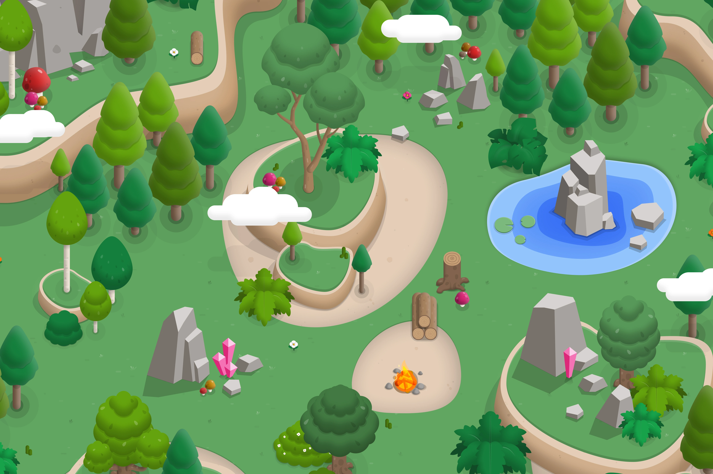
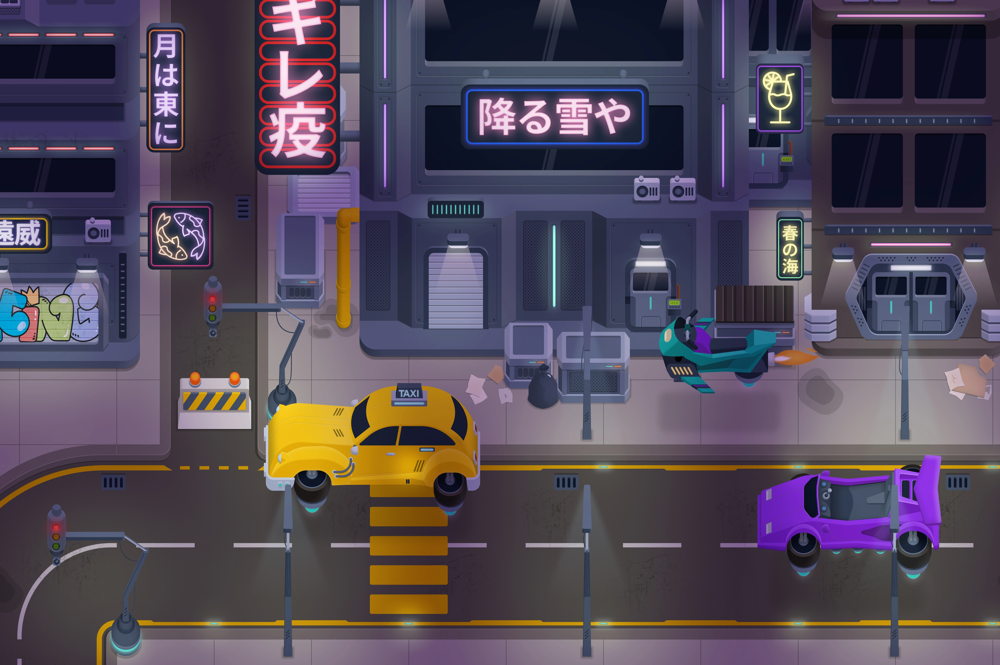
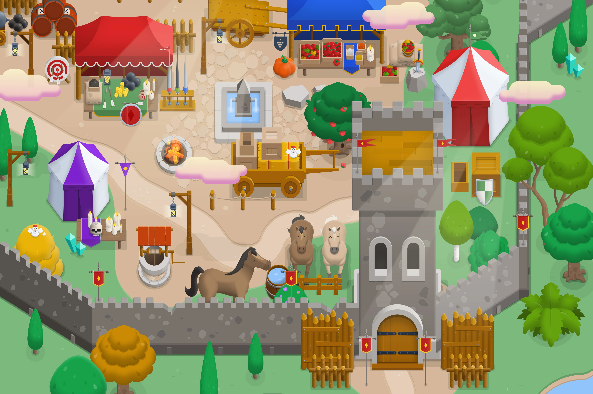

<p align="center">
  <a href="https://kitbitz.art">
    
  </a>
</p>

<h1 align="center">Kitbitz Assets</h1>

<p align="center"><strong>Small pieces. Whole worlds.</strong></p>

<p align="center">
  2,000+ free, hand-drawn illustrations for games, maps, prototypes,<br>
  posters, stories, and small strange worlds.
</p>

<p align="center">
  <a href="https://kitbitz.art"><strong>Browse the library →</strong></a>
  &nbsp;·&nbsp;
  <a href="LICENSE.md">Read the license</a>
</p>

<p align="center">
  
  
  
</p>

## What is Kitbitz?

Kitbitz is a free library of hand-drawn, mix-and-match illustrations grouped
into themed kits. Pick the pieces you want, combine them, recolour them, and
build whatever you like.

Every illustration is free to use, edit, and remix—including commercially—with
no attribution required.

## Why creators use it

- **2,000+ ready-to-use illustrations** across a growing collection of themed
  kits.
- **SVG and PNG formats** for easy editing or quick drop-in use.
- **Made to mix and match**, so trees, buildings, props, characters, and terrain
  work together in larger scenes.
- **Drawn by people.** None of the illustrations were generated by AI.
- **CC0 licensed.** Personal project, client work, commercial game—it is all
  fair game.

## See the pieces come together

<p align="center">
  <a href="kits/example-worlds/Nature-Example.webp">
    
  </a>
  <a href="kits/example-worlds/Cyberpunk-Example.webp">
    
  </a>
</p>

<p align="center"><sub>One library, very different worlds. Click an image to see it full-size.</sub></p>

## Explore the kits

- **Modern and strange:** [City](kits/city-kit),
  [Interior](kits/interior-kit), [Cyberpunk](kits/cyberpunk-kit), and
  [Space](kits/space-kit)
- **Adventure:** [Medieval](kits/medieval-kit),
  [Dungeon](kits/dungeon-kit), [Pirates](kits/pirate-kit),
  [Ruins](kits/ruins-kit), and [Western](kits/western-kit)
- **Nature and seasonal:** [Nature](kits/nature-kit),
  [Halloween](kits/halloween-kit), and [Winter](kits/winter-kit)
- **Bright and playful:** [Barbieland](kits/barbieland-kit)

> [!TIP]
> The easiest way to discover the collection is on
> **[kitbitz.art](https://kitbitz.art)**, where you can search, filter, preview,
> and download individual illustrations.

## Start building

1. Browse a themed kit or search the full collection on
   [kitbitz.art](https://kitbitz.art).
2. Choose an editable SVG or a transparent PNG.
3. Combine, recolour, resize, and remix the pieces into your own world.

The same catalog is also available through ready-made Figma kits and
components, the Kitbitz Figma plugin, and a read-only MCP server for compatible
AI tools.

<p align="center">
  <a href="kits/example-worlds/Medieval-Example.webp">
    
  </a>
</p>

<p align="center"><sub>Build a complete scene or borrow just one small piece.</sub></p>

## What lives in this repository?

This repository contains the original illustration artwork:

```text
kits/<kit-name>/
  Asset Name.svg
  Asset Name.png
  Optional kit example image
```

Catalog metadata, search, the website, and product tooling live outside this
asset repository.

## License

Original illustration assets in this repository are dedicated under
[CC0 1.0 Universal](LICENSE.md). You may copy, modify, and distribute them,
including commercially, without asking permission or providing attribution.

No attribution, no fuss. A mention is always appreciated, though. The
[license notice](LICENSE.md) also explains rights that CC0 does not grant.
